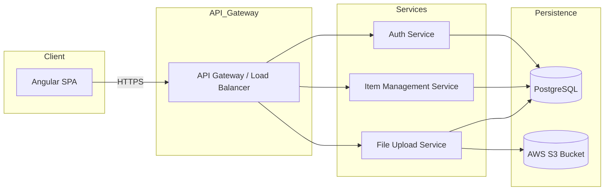

# System Design Specification

## 1. Architecture Overview

### 1.1 High-Level Architecture  
We propose a three‐tier, client‐server architecture based on a Single Page Application (SPA) frontend, RESTful backend services, and a centralized data and file storage layer.  
- Frontend: Angular SPA  
- Backend: Node.js (Express or NestJS) microservices  
- Persistence: Relational Database (PostgreSQL) for metadata; Object Storage (AWS S3) for image files  

### 1.2 Architecture Diagram  


### 1.3 Technology Stack  
- Frontend technologies  
  • Angular 14+ (TypeScript)  
  • Angular Material + Bootstrap 5  
  • RxJS for reactive streams  
- Backend technologies  
  • Node.js 16+ with NestJS or Express (TypeScript)  
  • JSON Web Tokens (JWT) for authentication  
  • Prisma or TypeORM for ORM  
- Database systems  
  • PostgreSQL for relational metadata (items, users)  
  • Redis (optional) for caching sessions or frequently accessed data  
- Object storage  
  • AWS S3 for image storage  
- Third-party services and APIs  
  • AWS SES (Email notifications)  
  • CloudFront CDN for static assets  
- Development tools  
  • Docker & Docker‐Compose for local dev  
  • Git & GitHub  
  • GitHub Actions for CI/CD  
  • Terraform for infrastructure as code  

---

## 2. Component Design

### 2.1 Frontend Components  
- **AppComponent**  
  • Root shell, routes navigation, global layout.  
- **HeaderComponent**  
  • Navbar with links, user avatar, logout.  
- **FileUploadComponent**  
  • Drag & drop file dropzone (max 5 PNGs, client‐side size check).  
  • Preview thumbnails.  
  • “Upload” & “Clear” buttons (enabled/disabled based on selection).  
- **ItemListComponent**  
  • Displays grid of uploaded items (card layout).  
  • Paginates via PaginationComponent.  
- **ItemCardComponent**  
  • Renders individual item details & action buttons (edit/delete).  
- **PaginationComponent**  
  • Handles page navigation.  
- **Services**  
  • `AuthService` (login, logout, token management)  
  • `FileService` (client‐side validations, file preview)  
  • `ApiService` (generic HTTP interceptor, error handler)  
  • `ItemService` (CRUD operations for items)  

### 2.2 Backend Services  
- **Auth Service**  
  • POST /api/auth/login → validate creds, issue JWT  
  • POST /api/auth/logout → revoke token (optional)  
  • Middleware to validate JWT on protected endpoints  
- **Item Management Service**  
  • GET /api/items → list items (with pagination & filters)  
  • POST /api/items → create new item metadata (file URLs from FileSvc)  
  • DELETE /api/items/:id → remove metadata + optionally trigger S3 delete  
- **File Upload Service**  
  • POST /api/files/upload → accepts multipart/form-data (max 5 PNGs)  
    – Validates file count, type, size  
    – Streams to S3, returns URLs  
  • DELETE /api/files → batch delete file URLs from S3  

### 2.3 Database Layer  
- Repository pattern via ORM (Prisma/TypeORM)  
- Connection pooling for Postgres  
- Transactions when linking file URLs and item metadata  

---

## 3. Data Models

### 3.1 Database Schema  

Users Table:  
- id: UUID (PK)  
- email: String (Unique)  
- password_hash: String  
- role: Enum('user','admin')  
- created_at: Timestamp  
- updated_at: Timestamp  

Items Table:  
- id: UUID (PK)  
- user_id: UUID (FK → Users.id)  
- title: String  
- tags: String[]  
- created_at: Timestamp  
- updated_at: Timestamp  

Files Table:  
- id: UUID (PK)  
- item_id: UUID (FK → Items.id)  
- file_url: String  
- file_name: String  
- content_type: String  
- size_bytes: Int  
- created_at: Timestamp  

### 3.2 Data Flow  
1. User drags/drops up to 5 PNG files in `FileUploadComponent`.  
2. Frontend validates file type/size/count; shows previews.  
3. On “Upload”, files are sent via `FileService` to `/api/files/upload`.  
4. FileSvc streams each file to S3, returns public/private URLs.  
5. Frontend collects URLs, sends metadata + title/tags to `/api/items`.  
6. ItemSvc stores metadata in Postgres; returns created item.  
7. UI refreshes item list via GET `/api/items`.  

---

## 4. API Design

### 4.1 Endpoints  

POST /api/auth/login  
- Request: `{ email: string, password: string }`  
- Response: `{ token: string, user: { id, email, role } }`  
- Auth: None  

GET /api/items  
- Query Params: `page`, `limit`, `search`, `tags[]`  
- Response: `{ items: Item[], total: number, page, limit }`  
- Auth: Bearer JWT  

POST /api/files/upload  
- Request: multipart/form-data up to 5 PNGs  
- Response: `{ files: [ { id, file_url, file_name, size_bytes, content_type } ] }`  
- Auth: Bearer JWT  

POST /api/items  
- Request:  
  `{ title: string, tags: string[], files: [ { id, file_url } ] }`  
- Response: `Item`  
- Auth: Bearer JWT  

DELETE /api/items/:id  
- Response: `{ success: boolean }`  
- Auth: Bearer JWT  

DELETE /api/files  
- Request: `{ fileIds: string[] }`  
- Response: `{ deleted: string[] }`  
- Auth: Bearer JWT  

### 4.2 API Patterns  
- RESTful conventions with plural nouns  
- HTTP status codes for success/failure  
- JWT Bearer tokens in `Authorization` header  
- CORS enabled only for allowed origins  

---

## 5. Security Design

### 5.1 Authentication Strategy  
- JWT with 1h expiry, refresh tokens stored in HTTP‐Only secure cookies  
- Password hashing with bcrypt (cost ≥12)  

### 5.2 Authorization  
- Role-based access control (RBAC) via `role` claim in JWT  
- Middleware checks:  
  • Users can only delete/modify own items  
  • Admin can manage all  

### 5.3 Data Protection  
- HTTPS enforced (TLS 1.2+)  
- Encryption at rest: AWS-managed encryption for S3 and RDS  
- Input validation and sanitization using class-validator (NestJS) or JOI  
- Rate limiting on auth endpoints (e.g., 5 req/min per IP)  

---

## 6. Integration Points

### 6.1 External Services  
- AWS S3  
  • SDK v3 for file operations  
- AWS SES  
  • Email confirmations upon signup or file deletion  
- CloudFront  
  • CDN distribution for S3‐hosted images  

### 6.2 Internal Integrations  
- API Gateway routes requests to microservices  
- Redis used for session caching and rate‐limit counters  

---

## 7. Performance Considerations

### 7.1 Optimization Strategies  
- Caching  
  • Redis for frequently accessed GET /api/items queries  
  • Browser caching via Cache-Control headers on S3 objects  
- Database indexing  
  • Index on `Items.user_id`, `Items.title` (GIN for tags)  
- Query optimization  
  • Pagination with OFFSET/LIMIT or keyset paging  
- Bundle optimization  
  • Angular CLI code splitting, lazy loading of routes  

### 7.2 Scalability  
- Horizontal scaling: replicate backend pods in Kubernetes  
- Load balancer (ALB/NLB) in front of services  
- Read replicas for PostgreSQL if read traffic high  
- S3 auto‐scales for storage needs  

---

## 8. Error Handling and Logging

### 8.1 Error Handling Strategy  
- Global exception filter (NestJS) / middleware (Express)  
- Standard error envelope:  
  `{ statusCode, message, errorCode?, details? }`  
- Client: show user-friendly messages, handle retry logic  

### 8.2 Logging and Monitoring  
- Structured JSON logs via Winston or Bunyan  
- Aggregate to ELK Stack (Elasticsearch, Logstash, Kibana) or AWS CloudWatch  
- Application performance monitoring (APM) with New Relic or Datadog  
- Health checks endpoint (`/healthz`) for liveness and readiness  

---

## 9. Development Workflow

### 9.1 Project Structure  
```
/project-root
  /frontend        ← Angular project
    /src
      /app
        /components
        /services
      environments
  /backend         ← Node/NestJS services
    /auth-service
    /item-service
    /file-service
  /infra           ← Terraform, Docker/Compose
  /docs
  /.github
```

### 9.2 Development Environment  
- Node.js v16+, npm/Yarn  
- Docker & Docker Compose for local Postgres, Redis, mock S3 (e.g., MinIO)  
- Environment variables in `.env.*` files  
- Angular CLI for frontend, Nest CLI or plain TypeScript tooling for backend  

### 9.3 Testing Strategy  
- Unit tests  
  • Frontend: Jasmine & Karma  
  • Backend: Jest  
- Integration tests  
  • Postman collections / Newman in CI  
- E2E tests  
  • Cypress against staging environment  
- Target 80%+ coverage  

---

## 10. Deployment Architecture

### 10.1 Deployment Strategy  
- CI/CD via GitHub Actions  
  • Lint → Unit tests → Build → Docker push → Helm/Terraform apply  
- Environments  
  • dev (feature branches)  
  • staging (merge into `develop`)  
  • production (merge into `main`)  

### 10.2 Infrastructure  
- Hosting: AWS EKS (Kubernetes) or ECS Fargate  
- Docker containers for each service  
- Helm charts for service deployment, ConfigMaps & Secrets for env variables  
- Postgres on AWS RDS (Multi-AZ)  
- Redis on AWS ElastiCache  
- S3 for object storage; CloudFront for CDN  
- Route53 for DNS; ACM for TLS certificates  

---

*This specification provides a detailed blueprint for implementing a secure, scalable, and maintainable image‐upload SPA with Angular, Node.js, and AWS infrastructure. It can be iterated upon during development to adjust to evolving requirements.*